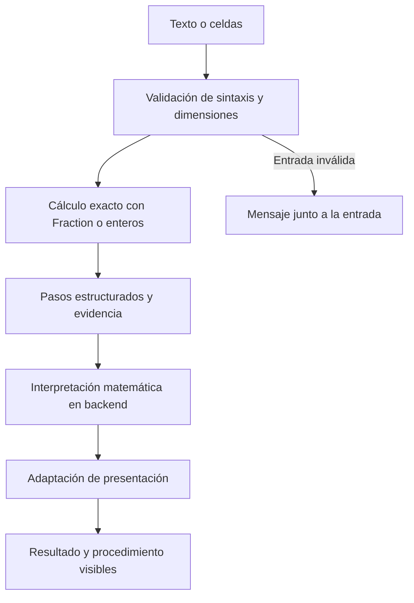
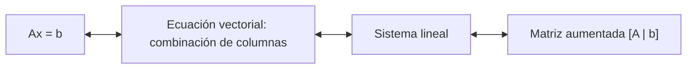

# Algoritmos y aprendizaje

[Índice de documentación](README.md) · [Portada](../README.md)

## Cálculo manual y exacto

Los algoritmos se construyen con Python estándar: listas, ciclos, condicionales
y operaciones aritméticas. `fractions.Fraction` representa racionales exactos;
no resuelve el álgebra por nosotros. NumPy, SciPy, SymPy y otras bibliotecas que
sustituyan estos algoritmos no forman parte del cálculo. Las dependencias de
Django, Waitress, pywebview y colorama son de interfaz o infraestructura.

El parser convierte enteros, decimales y fracciones desde texto, sin `eval` ni
`exec`. Calcular primero y formatear al final evita introducir redondeos o hacer
matemática manipulando cadenas.



## Sistemas y reutilización

Gauss busca pivotes, intercambia y normaliza filas y elimina hacia abajo.
Gauss-Jordan reutiliza ese escalonamiento y elimina hacia arriba. Las operaciones
elementales registran matriz anterior, operación y matriz posterior; los métodos
pueden mostrar procedimientos distintos conservando clasificación y solución.

Una matriz rectangular no implica un sistema. Los resolutores de sistemas
indican explícitamente que la última columna contiene los términos independientes
y excluyen esa columna de la búsqueda de pivotes. Una fila contradictoria decide
la inconsistencia; sin contradicción, las columnas sin pivote definen variables
libres. Una fila nula por sí sola no implica infinitas soluciones.

La solución general usa expresiones lineales (constante y coeficientes exactos)
y sustitución hasta eliminar dependencias entre variables pivote. La evidencia
de contradicciones, filas redundantes y variables libres queda en el backend;
el frontend no vuelve a deducirla. Los ejemplos están en
[Funcionalidades](funcionalidades.md#interpretación-del-resultado).

## Conexiones entre matrices, vectores y sistemas

Para x conocido, `Ax = x₁a₁ + … + xₙaₙ`: multiplicar por un vector es combinar
las columnas de A. Cada entrada también se obtiene como producto punto de una
fila de A por x. En `AB`, cada columna del resultado es `Abⱼ`.
Los productos se calculan una vez y se agrupan por entrada y por columna para
mostrar ambas lecturas.

Para x desconocido, las representaciones son equivalentes:



`ecuaciones_matriciales.py` construye `[A | b]` y llama al motor de sistemas.
`vectores.py` hace lo mismo para preguntar si b es combinación de sus generadores,
nombrando las incógnitas `c1`, `c2`, etc. Solución única o infinitas significa que
sí existe esa combinación; una contradicción significa que no. En combinación
lineal con infinitas soluciones se puede mostrar una combinación concreta fijando
los coeficientes libres en cero. No se añade otro algoritmo de eliminación.

## Dependencias internas

```text
vectores                →  sistemas
vectores                →  matrices
ecuaciones_matriciales  →  sistemas
ecuaciones_matriciales  →  matrices
expresiones_matriciales →  matrices
expresiones_matriciales →  vectores
sistemas  →  gauss_jordan  →  gauss  →  operaciones_filas  →  matrices
sistemas  →  expresiones   →  matrices
```

`vectores.py` no escalona nada por su cuenta: escribe la combinación lineal
como matriz aumentada y llama a `resolver_sistema_gauss_jordan`, pidiéndole
que nombre las incógnitas `c1, c2, …`. Gauss y Gauss-Jordan siguen escribiendo
`x1, x2, …` por defecto. La validación de un vector vive en `matrices.py`,
junto al producto punto, porque las filas y columnas de una matriz también son
vectores; `vectores.py` la importa de ahí. Los productos `AB` y `Ax` no
dependen de `vectores.py`: la explicación por columnas es la misma combinación
lineal, y las pruebas comprueban que coincide con `combinar` de ese módulo.
`ecuaciones_matriciales.py` tampoco escalona: escribe `Ax = b` como `[A | b]`
y llama al motor de sistemas elegido; al vivir por encima de `sistemas.py` y
de `matrices.py`, `matrices.py` no necesita importar `sistemas.py`.

`expresiones_matriciales` no recalcula los productos numéricos. El parser arma
un árbol; cada nodo llama a `sumar_matrices`, `restar_matrices`,
`multiplicar_escalar_matriz`, `multiplicar_matrices`,
`multiplicar_matriz_vector` o a las operaciones de `vectores.py`. El
procedimiento de un producto es el que ya devuelve
`resolver_operacion_matrices`. Una igualdad numérica no añade un nodo
aritmético: son dos árboles de ese parser, evaluados por separado y comparados
con `Fraction`.

Si A se declaró desconocida y x es un vector simbólico, el producto `Ax` no
pasa por Gauss. Cada componente del otro lado se normaliza a una forma lineal
(constante y coeficientes `Fraction`). La columna j de A es el coeficiente de
la variable j de x, en el orden del vector, no el alfabético. `coef_vector`
es esa extracción. La comprobación vuelve a armar `Ax` y compara coeficientes;
no sustituye números. `backend/expresiones.py` sigue siendo la forma lineal de
los sistemas (variables numeradas `x1`, `x2` para Gauss). No se mezcla con
esta: allí la variable es un índice, aquí el nombre completo lo declara el
vector simbólico.

`ecuaciones_matriciales` sigue resolviendo `Ax = b` por el motor de sistemas
cuando A y b son numéricos y x es la incógnita. No usa esta comparación.

Gauss-Jordan no repite el escalonamiento: llama a `aplicar_gauss` y solo añade la
eliminación hacia arriba, así que la diferencia entre los dos métodos está en un
único bloque de código.

`expresiones.py` representa a mano una expresión lineal como una constante más un
coeficiente por variable, y es lo que permite despejar sin manipular texto: primero
se calcula la expresión con `Fraction` y solo al final se escribe. `sistemas.py`
usa esa misma pieza para traducir matrices a ecuaciones y para construir el
conjunto solución, de modo que Gauss y Gauss-Jordan comparten la interpretación
entera.

`parser_sistemas.py` queda fuera de esa cadena porque no depende de ningún otro
módulo del proyecto: recibe texto y devuelve una matriz, o lanza `ValueError`. Eso
permitirá reutilizarlo tal cual desde otra interfaz.

El backend no usa `input()` ni `print()` y no depende del frontend. Los servicios
web formatean los datos para templates; la terminal agrega títulos y colores.
Las reglas para mantener esta separación están en [CONTRIBUTING](../CONTRIBUTING.md).

## Conversión de bases

Se extienden los dos procesos manuales existentes, con enteros y `Fraction`
para conservar valores exactos, sin `float`:

- **Desde decimal:** la parte entera sigue usando divisiones sucesivas y lee
  los residuos de abajo hacia arriba. La parte fraccionaria usa multiplicaciones
  sucesivas por la base destino: toma el entero como siguiente dígito y continúa
  con la fracción restante. Los dígitos fraccionarios se leen de arriba hacia
  abajo. Por ejemplo, `5.5₁₀ = 5.8₁₆`: se divide 5 entre 16 y se multiplica
  `0.5 × 16 = 8`, con fracción restante cero.
- **Hacia decimal:** una sola expansión posicional incluye exponentes positivos,
  cero y negativos. `101.101₂ = 1·2² + 0·2¹ + 1·2⁰ + 1·2⁻¹ + 0·2⁻² + 1·2⁻³
  = 5.625₁₀`; `A.F₁₆ = 10·16⁰ + 15·16⁻¹ = 10.9375₁₀`.

Entre bases no decimales se mantiene **origen → decimal exacto → destino**.
No hay tablas ni agrupaciones particulares para cada par de bases.
`digitos.py` convierte símbolos A–F y calcula potencias; `validacion.py`
comprueba bases y dígitos a ambos lados del punto. Acepta `.31` como `0.31`
y `5.` como `5`; rechaza múltiples puntos, solo `.`, signos y dígitos inválidos.
Los paréntesis de períodos son una notación de salida, no una sintaxis de entrada.

`conversion.py` devuelve pasos estructurados de división, expansión y
`PasoMultiplicacion` (fracción inicial, base, producto, dígito, símbolo y fracción
restante). `ConversionDesdeDecimal.pasos` conserva las divisiones existentes;
`multiplicaciones` registra la etapa fraccionaria por separado. La web prepara
las fórmulas y explicaciones en `servicios_bases.py`; los templates solo las
renderizan y no muestran divisiones de cero cuando el valor es menor que uno.

`convertir_a_varias_bases` es la abstracción multidestino sobre esas mismas
funciones: valida el origen y los destinos (sin repetidos, sin la base de
origen, al menos uno), lleva el número a decimal una sola vez y reutiliza ese
valor en las divisiones y multiplicaciones de cada destino no decimal; el destino decimal,
si se pidió, es el propio valor intermedio. `convertir` es su caso de un destino.
`escribir_decimal_exacto` escribe ese racional escalando su denominador 2ⁿ·5ᵐ
a una potencia de diez, sin redondear ni volver a interpretar el origen.

### Expansiones periódicas

Antes de cada multiplicación se registra la fracción restante y su posición.
Si llega a cero, la expansión es finita. Si una fracción se repite, desde allí
se repetirán los mismos dígitos: se guarda la parte no periódica, la parte
periódica y `inicio_periodo` (índice desde cero dentro de los dígitos fraccionarios;
`None` cuando es finita). Así, `0.31₁₀ = 0.4(F5C28)₁₆` tiene parte no periódica
`4`, período `F5C28` e inicio `1`. Los paréntesis señalan el período en la salida.

Aunque todo racional termina o repite, su período puede ser enorme incluso
con una entrada corta. El límite de seguridad es **1024 multiplicaciones por
destino**. Primero se comprueba la repetición, incluso tras el último paso
permitido; si no termina ni se detecta un período dentro del límite, se lanza
`ValueError` con una explicación visible. No se devuelve una aproximación ni
un resultado truncado. El límite protege tiempo, memoria y tamaño del
procedimiento; no sustituye la detección de ciclos.

No se usan `bin`, `oct`, `hex` ni `int(texto, base)` para resolver la conversión.
Las pruebas AST comprueban esta restricción y los ejemplos se conservan en
[Sistemas numéricos](funcionalidades.md#sistemas-numéricos).
