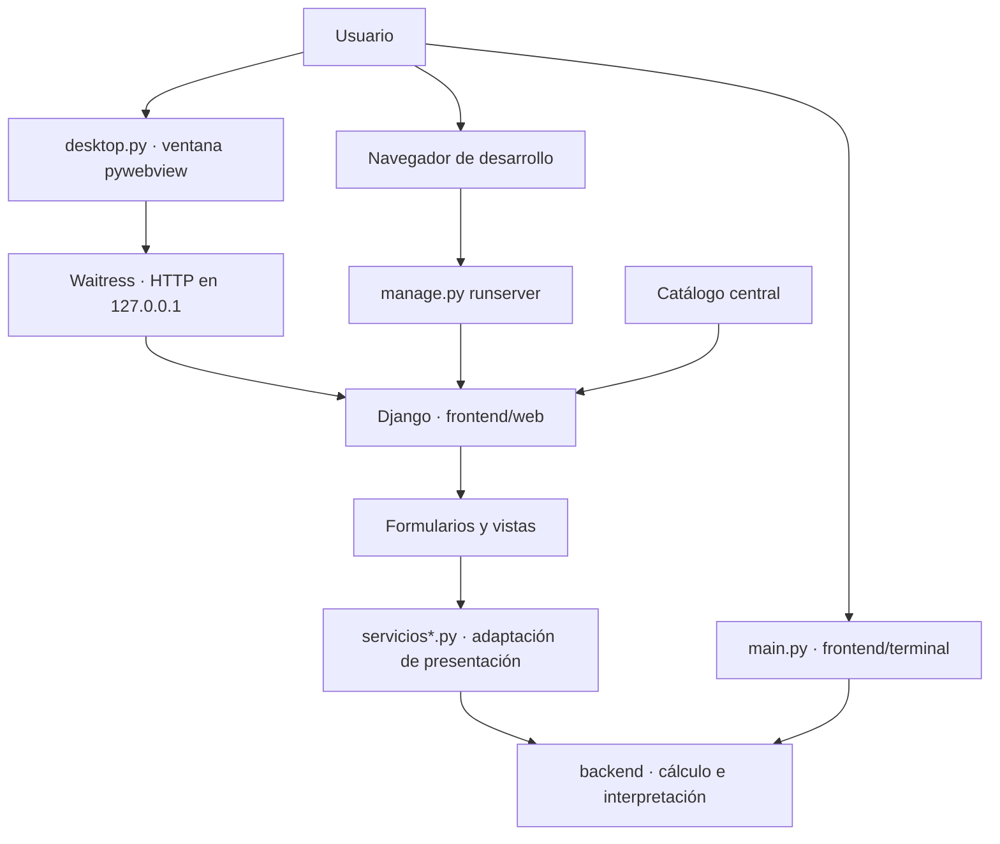

# Arquitectura

[Índice de documentación](README.md) · [Portada](../README.md)

El cálculo vive en `backend/`; las interfaces lo consumen sin duplicarlo.
La terminal llama directamente al backend. Las vistas Django validan formularios
y usan `servicios*.py` como adaptadores de presentación; no hay una capa de
servicios independiente compartida por todas las interfaces.



## Mapa del código

| Ruta | Responsabilidad |
| --- | --- |
| `backend/` | Matrices, operaciones por filas, Gauss, Gauss-Jordan, expresiones, sistemas, vectores, Ax=b y bases. |
| `frontend/terminal/` | `menu.py` coordina; `opciones.py` ejecuta opciones; `entradas.py` lee; `salida.py` presenta; `consola.py` maneja color, pausas y limpieza. |
| `frontend/web/algebra_web/` | Configuración Django, rutas raíz y entradas WSGI/ASGI. |
| `frontend/web/calculadora/` | Formularios, vistas, servicios, catálogo, teclados, guías, exploraciones, templates y recursos locales. |
| `desktop.py` | Servidor local y ciclo de vida de la ventana nativa. |
| `AlgebraLineal.spec` | PyInstaller: Python, dependencias, templates, recursos e icono en una carpeta `onedir`, sin consola (`windowed`). |
| `installer/AlgebraLineal.iss` | Inno Setup: empaqueta esa carpeta, accesos directos, prerrequisito WebView2 y desinstalación. |
| `scripts/` | Build Windows, smoke de distribución y validación de tags de release. |
| `tests/` | Pruebas matemáticas, frontend, infraestructura, distribución y documentación. |
| `assets/` | Identidad SVG e icono ICO existentes. |
| `pyproject.toml`, `uv.lock`, `.python-version` | Versión/dependencias declaradas, resolución bloqueada y Python de referencia. |
| `.github/workflows/` | CI de validación y CD de publicación desde tags de `main`. |

## Catálogo y presentación

`frontend/web/calculadora/catalogo.py` es el registro central: las estructuras
inmutables `Area`, `Categoria` y `Herramienta` definen identidad, descripción,
estado, nombre de ruta Django, palabras clave, relaciones por ID y la frase
con la que se sugiere una herramienta desde otra. No usan base de datos. La
barra lateral, el buscador (`buscar_herramientas`, sin acentos ni mayúsculas),
el Inicio, los breadcrumbs y las herramientas relacionadas derivan de ahí:
`context_processors.navegacion` identifica la herramienta activa a partir de la
ruta resuelta, así que las vistas no arman la navegación a mano.

El catálogo permite sumar áreas sin rehacer la navegación. Los módulos marcados
«Próximamente» no se enlazan como herramientas disponibles.

Resolver un sistema usa una sola vista: `opciones_sistemas.py`
declara los métodos, los bloques del resultado, sus valores predeterminados y
las rutas antiguas que redirigen a la herramienta. Operaciones con vectores
hace lo mismo con `opciones_vectores.py` (operaciones, límites de dimensión y
de vectores, nombres de los vectores por operación) y `servicios_vectores.py`
(presentación: vectores como `(1, 2, 3)`, desarrollo componente a componente,
planteamiento y conclusión de la combinación lineal).

```text
templates/calculadora/
├── base.html                 # header, cajón de navegación, breadcrumbs y contenido
├── layouts/herramienta.html  # estructura común de una herramienta
├── components/               # cajón, buscador, breadcrumbs, relacionadas, explorar, teclado, matrices, vectores, guías
├── pages/                    # inicio.html y _area.html (temas de un área)
├── modules/sistemas/         # index.html y parciales del procedimiento y el resultado
├── modules/vectores/         # index.html, fila de entrada, operación y combinación lineal
├── modules/matrices/         # entrada rectangular, resultado y procedimientos
├── modules/ecuaciones/       # Ax = b: entrada, equivalencias y eliminación reutilizada
└── modules/bases/            # index.html y procedimiento de la conversión
```

Los detalles de UI/UX y los scripts JavaScript se documentan en
[Interfaz](interfaz.md). El parser y las dependencias internas del cálculo se
explican en [Algoritmos](algoritmos.md).

## Ejecución y empaquetado

Django recibe los mismos formularios en navegador y escritorio. Waitress sirve
la aplicación en un puerto efímero de `127.0.0.1`; el launcher comprueba
`HTTP GET /` antes de crear la ventana pywebview. Al cerrarla llama a
`server.close()` y espera el thread de Waitress. El launcher no contiene lógica
matemática y no usa `runserver` ni abre un navegador externo.

PyInstaller reúne el runtime Python y los recursos; Inno Setup transforma esa
carpeta en el instalador de Windows. El build obtiene la versión únicamente de
`pyproject.toml`. WebView2 renderiza la ventana; solo su instalación, si falta,
puede requerir Internet. CSS, JavaScript, iconos y cálculos son locales.

Consulta [Instalación Windows](instalacion-windows.md), [Pruebas](pruebas.md)
y [Releases](releases.md) para verificar y entregar el paquete.
