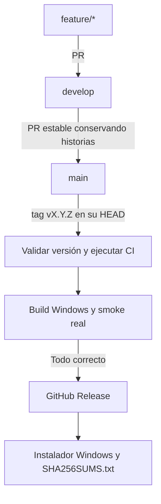

# Versionado y releases

[Índice de documentación](README.md) · [Portada](../README.md)

## Versionado

La única fuente de versión es `project.version` en
[`pyproject.toml`](../pyproject.toml). El build la lee y genera
`AlgebraLineal-Setup-<version>.exe`; no edites otra copia en scripts o Inno Setup.
`uv.lock` refleja los metadatos del proyecto y se regenera con `uv lock`.

Usamos [Semantic Versioning](https://semver.org/lang/es/) con tres números:

- **PATCH** (`X.Y.Z` → `X.Y.Z+1`): correcciones compatibles.
- **MINOR** (`X.Y.Z` → `X.Y+1.0`): módulos o capacidades nuevas compatibles.
- **MAJOR** (`X.Y.Z` → `X+1.0.0`): cambios incompatibles importantes.

Durante la etapa `0.x` el proyecto sigue evolucionando; describe cualquier cambio
de compatibilidad en las notas. La política inicial solo publica tags estables
`vX.Y.Z`, sin sufijos de prerelease ni componentes adicionales.

## Flujo de integración y entrega



La promoción `develop → main` se hace mediante un PR separado, después de
integrar el incremento en `develop`. No se igualan ramas mediante reset ni
force-push: el merge conserva también los commits propios de `main`.
Antes de promover, actualiza referencias y revisa la comparación y la simulación:

```bash
git fetch --prune
git log --left-right --graph --oneline origin/main...origin/develop
git diff origin/main...origin/develop
git merge-tree --write-tree origin/main origin/develop
```

`merge-tree` simula la combinación sin tocar ramas ni el working tree. Revisa su
código de salida y posibles conflictos; una simulación limpia no sustituye CI.

## Preparar y publicar una versión

1. En una rama desde `develop`, actualiza `project.version`, ejecuta `uv lock`
   y las [verificaciones](pruebas.md). Incluye el cambio en el PR de integración.
2. Una vez integrado, abre el PR `develop → main`, espera CI y realiza la
   revisión de la distribución. La promoción requiere su propia decisión de merge.
3. Después del merge, desde un checkout limpio y actualizado de `main`, lee la
   versión y crea el tag correspondiente. Este paso es una publicación explícita:

   ```powershell
   git fetch --prune
   git switch main
   git pull --ff-only origin main
   # Verifica working tree limpio y HEAD idéntico a origin/main antes de continuar.
   $version = uv run --locked python -c "import pathlib,tomllib; print(tomllib.loads(pathlib.Path('pyproject.toml').read_text(encoding='utf-8'))['project']['version'])"
   git tag -a "v$version" -m "Álgebra Lineal v$version"
   git push origin "v$version"
   ```

Si `pull --ff-only` falla por divergencia local, investígala; no uses reset o
force-push para resolverla. No etiquetes `develop` ni una rama feature.

## Qué comprueba CD

[`release.yml`](../.github/workflows/release.yml) responde solo a pushes de tags
`v*.*.*`. El filtro inicial es amplio; [`validate_release.py`](../scripts/validate_release.py)
exige después el formato exacto y comprueba:

- el tag coincide con `v` + `project.version`;
- el checkout es el commit del tag (también para tags anotados);
- ese commit es **exactamente el HEAD actual de `origin/main`**.

Pertenecer a la historia de `main` no basta. Un tag antiguo falla. No se modifica
la versión ni se crea un tag automáticamente. Si `main` avanza durante el build,
la comprobación final rechaza la entrega; por eso conviene evitar promociones
concurrentes durante una publicación. La comprobación final consulta el remoto
inmediatamente antes de generar/publicar los assets; no bloquea escrituras de
otros mantenedores en GitHub.

Después de validar, CD llama al workflow reutilizable
[`ci.yml`](../.github/workflows/ci.yml) de ese mismo commit:

- Ubuntu: `uv lock --check`, `uv sync --locked`, suite completa, `manage.py check`
  y `compileall`, con ejecución locked.
- Windows: uv e Inno Setup, [`build_windows.ps1`](../scripts/build_windows.ps1),
  suite completa y [`test_windows_distribution.ps1`](../scripts/test_windows_distribution.ps1).
- El smoke instala, verifica accesos, abre dos veces, comprueba Django/Waitress,
  sistemas, operaciones matriciales, AB, Ax, Ax=b y recursos, cierra y desinstala.
  Su [alcance y requisitos](instalacion-windows.md#comprobar-la-distribución-real)
  siguen siendo los del script existente.

El smoke también corre en PRs para detectar fallos antes de crear el tag.
El job Windows conserva su timeout y todas sus pruebas. Un artifact puede quedar
disponible para diagnóstico aunque falle un check; **CD solo publica si todos
los jobs terminaron correctamente**.

## Permisos, assets y notas

Los jobs de validación y build tienen `contents: read`. Solo `publicar` dispone
de `contents: write`; ese job descarga el artifact de la misma ejecución, sin
checkout y sin ejecutar el instalador ni scripts del repositorio. Las actions
externas están fijadas a SHA, con su versión indicada en un comentario.

Antes de publicar se consulta de nuevo el commit de `main` y del tag. También
se comprueba que no haya una release, incluido un borrador, para ese tag.
Un error al consultar GitHub detiene el job. Las publicaciones se serializan y
una ejecución nueva no cancela una publicación en curso.

Los únicos assets públicos son:

- `AlgebraLineal-Setup-<version>.exe`;
- `SHA256SUMS.txt`, con el SHA-256 y el nombre del instalador.

No se publica la carpeta PyInstaller, `build/` ni el bootstrapper de WebView2
por separado. El instalador ya contiene el prerrequisito según el proceso de build.
El artifact de CI es temporal y sirve para revisión; la release es una entrega
estable asociada a un tag de `main`.

Se usa [GitHub CLI](https://cli.github.com/manual/gh_release_create), disponible
en el runner, con `--verify-tag` y `--generate-notes`. Se crea primero un borrador
con ambos assets y luego se publica. GitHub genera las notas desde el historial
y los PRs; no se mantiene un changelog enorme en YAML.

## Fallos y reintentos

Si versión/tag, tests, build o smoke fallan, no se publica. Corrige el problema
mediante el flujo de PR y prepara una versión apropiada; no muevas silenciosamente
un tag estable ya distribuido.

Una release existente hace fallar el workflow: no se usa `--clobber` ni se
sobrescriben assets. Si una carga o la publicación final falla, puede quedar un
borrador parcial. Revísalo manualmente en GitHub antes de decidir si completarlo
o eliminar ese borrador fallido y reintentar. Nunca borres una release estable
para ocultar una corrección. Un fallo transitorio anterior a crear el borrador
permite reejecutar, siempre que `main` y el tag sigan en el mismo commit.

## Validar sin publicar

No hay `workflow_dispatch` de publicación. En desarrollo se ejecutan las
pruebas de contratos del workflow y del validador:

```bash
uv run --locked python -m unittest tests.test_release tests.test_documentacion -v
```

Las pruebas de Git crean repositorios temporales, sin tags en este repositorio.
El validador se puede invocar de forma independiente con `--ref refs/tags/vX.Y.Z`
para un tag ya existente, tras actualizar `origin/main`; no escribe refs ni
publica nada. Las pruebas estáticas no equivalen a una ejecución de publicación.

## Verificar una descarga

Descarga ambos assets de la misma release. En PowerShell:

```powershell
Get-FileHash .\AlgebraLineal-Setup-*.exe -Algorithm SHA256
Get-Content .\SHA256SUMS.txt
```

Compara el hash y el nombre. En Linux, desde la carpeta de descarga:

```bash
sha256sum --check SHA256SUMS.txt
```

El checksum permite detectar que el archivo difiere del publicado. No es una
firma digital: el proyecto no dispone de certificado de firma de código y
Windows puede mostrar un editor desconocido.
