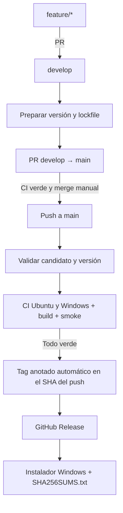

# Versionado y releases

[Índice de documentación](README.md) · [Portada](../README.md)

## Versionado

La única fuente de versión es `project.version` en
[`pyproject.toml`](../pyproject.toml). El build la lee para generar
`AlgebraLineal-Setup-<version>.exe`. `uv.lock` refleja los metadatos y se
regenera con `uv lock`; no se edita a mano.

Usamos [Semantic Versioning](https://semver.org/lang/es/) estable `X.Y.Z`:

- **PATCH**: correcciones compatibles.
- **MINOR**: capacidades nuevas compatibles.
- **MAJOR**: cambios incompatibles importantes.

No se admiten prereleases, metadatos extra, cuatro componentes ni ceros
iniciales. Durante la etapa `0.x`, describe cualquier cambio de compatibilidad
en las notas. El incremento preparado de 0.7.0 a 0.8.0 es MINOR por las
capacidades compatibles añadidas, incluidas la verificación, propiedades y
aplicación de Matriz inversa. Una versión preparada en `develop` aún no es
una release publicada.

## Flujo de integración y entrega


```mermaid
flowchart TD
    F["feature/*"] -->|PR| D[develop]
    D --> P[Preparar versión y lockfile]
    P --> PR["PR develop → main"]
    PR -->|CI verde y merge manual| M[Push a main]
    M --> V[Validar candidato y versión]
    V --> C[CI Ubuntu y Windows + build + smoke]
    C -->|Todo verde| T[Tag anotado automático en el SHA del push]
    T --> R[GitHub Release]
    R --> I[Instalador Windows + SHA256SUMS.txt]
```

**Nada entra a `main` si no está listo para publicarse.** El merge a `main`
es la autorización humana de publicación. GitHub Actions crea el tag después
de CI; no hay un segundo paso manual de etiquetado.

La promoción `develop → main` se realiza mediante un PR separado, después de
integrar el incremento en `develop`. El merge conserva ambas historias.
Antes de promover, revisa la comparación y simula la integración:

```bash
git fetch origin --prune --tags
git log --left-right --graph --oneline origin/main...origin/develop
git diff origin/main...origin/develop
git merge-tree --write-tree origin/main origin/develop
```

`merge-tree` no toca las ramas ni el working tree. Revisa su código de salida
y los conflictos; una simulación limpia no sustituye CI.

## Preparar una versión

1. Desde `develop` actualizado, crea una rama, decide `project.version`, ejecuta
   `uv lock` y las [verificaciones](pruebas.md). Abre el PR hacia `develop`.
2. Después de integrarlo, abre el PR `develop → main`, espera CI verde y revisa
   la distribución. La decisión de merge inicia la publicación automáticamente.
3. Sigue la ejecución **Release** en Actions y comprueba sus assets al terminar.

No promuevas otra versión a `main` hasta que termine la publicación actual y
se resuelva cualquier fallo pendiente. No uses reset ni force-push para igualar
ramas, ni muevas tags estables existentes.

## Validación y CI

[`release.yml`](../.github/workflows/release.yml) se dispara **únicamente por
push a `main`**. Los tags son artefactos del proceso, sin trigger por tags,
`workflow_dispatch`, `pull_request` ni `workflow_run`.

[`validate_release.py`](../scripts/validate_release.py) exige:

- origen `refs/heads/main`;
- checkout en el SHA completo del evento (`github.sha`);
- `project.version` estable y derivación exacta de `v<version>`;
- versión no regresiva frente a todos los tags estables existentes, comparados
  numéricamente: `0.10.0 > 0.9.0`;
- si el tag objetivo existe, que apunte al mismo commit, resolviendo también
  tags anotados. Otro commit se rechaza inmediatamente.

Devuelve `version`, `tag` y `commit` sin modificar archivos ni refs.
Un tag del mismo commit permite reintentar; si ya hay una versión estable
posterior, el reintento también se rechaza para evitar publicar hacia atrás.

El checkout de validación y ambos checkouts de
[`ci.yml`](../.github/workflows/ci.yml) usan el SHA del evento. El workflow
reutilizable local pertenece al mismo commit; sus assets se descargan desde
esa misma ejecución. La creación del tag usa exactamente ese SHA, sin volver
a consultar el HEAD de `main`. Un avance normal de `main` durante el build
no invalida al candidato.

CI conserva todas las comprobaciones:

- Ubuntu: lockfile, entorno locked, suite completa, Django y compilación.
- Windows: [build de aplicación e instalador](../scripts/build_windows.ps1),
  suite completa y [smoke de instalación/desinstalación](../scripts/test_windows_distribution.ps1),
  con dos aperturas, accesos directos, recursos y cálculos por HTTP.

CI corre en push a `develop`, PR hacia `develop` o `main` y `workflow_call`.
Después del merge a `main`, Release lo llama una sola vez; no hay otro CI por
ese push. El CI reutilizado aísla su grupo por ejecución y no cancela una release.

## Tag, permisos y publicación

Si falla validación, tests, build o smoke, **no se crea tag ni release**.
Solo después de que CI termina correctamente, el job `publicar`:

1. Descarga el artifact de la misma ejecución.
2. Revisa de nuevo los tags remotos, rechaza regresiones y comprueba que no
   exista una release para el tag, **incluidos drafts**. Un error de API detiene
   el job. Si el tag ya existe, verifica nuevamente su commit.
3. Comprueba que el artifact contenga solo el instalador esperado y crea
   mediante la API un **tag anotado**, con mensaje `PyGebra vX.Y.Z`,
   y su ref en el SHA candidato. Un tag del mismo commit se reutiliza.
   No hay actualización de refs, force ni credenciales Git persistidas.
4. Genera `SHA256SUMS.txt` después de descargar el artifact y verifica el hash.
5. Crea un draft titulado **PyGebra vX.Y.Z**, con notas de GitHub
   (`--generate-notes`) y los dos assets.
6. Comprueba los nombres de ambos assets, los descarga del draft, compara el
   checksum y vuelve a verificar el instalador antes de publicar como `latest`.

Los permisos globales son `contents: read`; únicamente `publicar` tiene
`contents: write`. Los checkouts usan `persist-credentials: false`.
El job con escritura no hace checkout ni ejecuta scripts del repositorio o el
instalador; usa comandos del workflow. Las actions externas están fijadas a SHA.
Todo concluye en la misma ejecución, sin depender de otro workflow por el tag.

Los únicos assets públicos son:

- `AlgebraLineal-Setup-<version>.exe`;
- `SHA256SUMS.txt`.

La carpeta PyInstaller, `build/`, logs y bootstrapper WebView2 no se publican
por separado. Los artifacts de CI son temporales; las Releases son entregas
estables. El badge estándar de la portada enlaza a la última release publicada
sin fijar la versión preparada en el README.

## Concurrencia

Release usa un grupo compartido, `cancel-in-progress: false` y `queue: max`.
La [cola de GitHub Actions](https://docs.github.com/en/actions/how-tos/write-workflows/choose-when-workflows-run/control-workflow-concurrency)
admite hasta 100 ejecuciones pendientes; a diferencia de la cola predeterminada,
una tercera promoción no sustituye silenciosamente a la segunda.

La cola sigue el orden de entrada a espera, que no garantiza el orden de los
pushes; al llenarse se cancelan las ejecuciones adicionales. Por eso se mantiene
la regla operativa de **una promoción a main a la vez**, esperando la release.
La cola evita sustituciones normales; no implementa un sistema de locking ni
impide cambios manuales de otros mantenedores en GitHub.

## Fallos y reintentos

- **Antes de crear el tag:** no quedan tag ni release nuevos. Un fallo
  transitorio permite reejecutar el workflow desde Actions para el mismo SHA.
- **Después del tag y antes del draft:** se puede reejecutar para el mismo
  commit. Se repite CI y se reutiliza el tag solo si sigue apuntando a ese SHA
  y no existe una versión posterior.
- **Si existe una release o draft:** el workflow se detiene. Revisa manualmente
  un draft parcial antes de completarlo o eliminar ese borrador fallido y
  reintentar. No se sobrescribe ni se usa `--clobber`.
- **Si la release ya se publicó:** un reintento no la reemplaza. Una corrección
  requiere otra versión preparada y promovida por PR.

Nunca muevas un tag estable ni borres una release publicada para ocultar una
corrección. Una modificación del código requiere un nuevo commit y una versión
apropiada; el reintento del mismo SHA reconstruye el mismo candidato.

## Validar sin publicar

```bash
uv run --locked python -m unittest tests.test_release tests.test_documentacion -v
```

Las pruebas crean repositorios temporales y comprueban el candidato y los
contratos de los workflows, sin crear tags en este repositorio. El validador
también admite `--ref refs/heads/main --sha <SHA-del-evento>` desde un checkout
de ese commit con los tags actualizados; solo lee. Completa la suite, CI, build
y smoke normales, sin crear tags remotos o releases de prueba.

## Verificar una descarga

Descarga ambos assets de la misma release. En PowerShell:

```powershell
Get-FileHash .\AlgebraLineal-Setup-*.exe -Algorithm SHA256
Get-Content .\SHA256SUMS.txt
```

Compara el hash y el nombre. En Linux, desde la carpeta de descarga:

```bash
sha256sum --check SHA256SUMS.txt
```

El checksum detecta diferencias con el archivo publicado. No es una firma
digital; Windows puede mostrar un editor desconocido.
